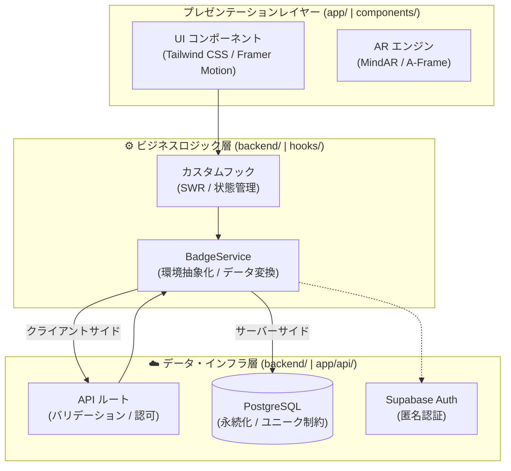

# アーキテクチャおよび技術設計

### 3層構造の設計とレンダリング戦略

システムは、プレゼンテーションレイヤー、ビジネスロジックレイヤー、およびデータ永続化レイヤーの間で明確な関心の分離 (SoC) を実現するように設計されています。

---

## 1. システムアーキテクチャ

---

## 2. 通信プロトコルの選定理由

本システムでは、要件に合わせて複数のプロトコルを使い分けています。

### REST (HTTP/2)

- **用途**: 主要なリソース操作（標本データの取得、プロフィール更新等）。
- **選定理由**: ブラウザとの互換性が最大であり、Next.js API Routes を通じたステートレスなスケーリングが容易であるため。

### WebSockets / SSE (Server-Sent Events)

- **用途**: リアルタイムな同期（他ユーザーの活動通知、管理者によるマスターデータ更新の即時反映）。
- **選定理由**: Supabase Realtime を介して、データベースの変更を低遅延でクライアントに Push するため。

### gRPC / GraphQL (検討と判断)

- **gRPC**: 内部マイクロサービス間の通信ではないため、ブラウザからの直接利用には不向きと判断し、採用を見送り。
- **GraphQL**: 現時点ではデータ構造がシンプルであり、オーバーフェッチの問題が小さいため、REST のシンプルさを優先。

---

## 3. レンダリング戦略

### レンダリング手法

- **Server-Side Rendering (SSR)**: 初期表示速度の向上と SEO 対応のため、Next.js のサーバーコンポーネントを使用して初期データを取得します。これにより、クライアント側での初期ロード時間を短縮しています。
- **Client-Side Rendering (CSR)**: AR エンジンのライフサイクル制御や、ユーザー操作に伴う動的なデータ更新（SWR による再検証）に使用します。AR 体験の即時性を確保するための選択です。

### 通信の最適化

- **SWR (Stale-While-Revalidate)**: クライアントサイドでのキャッシュ戦略として採用。リクエスト時に即座にキャッシュを返し、バックグラウンドで再検証を行うことで、ネットワーク遅延を感じさせない UI を実現しています。

---

## 4. 各レイヤーの責務

### 📂 プレゼンテーションレイヤー (View)

- **役割**: ユーザーインターフェースの提供と、センサー（カメラ）情報の入力。
- **UI フレームワーク**: Tailwind CSS による宣言的なスタイリングと、Framer Motion による滑らかなアニメーション制御。

### 📂 ビジネスロジック層 (Logic)

- **役割**: データの取得戦略と、UIが必要とする形式へのデータ変換。
- **BadgeService**: `backend/services/` に配置。ブラウザ（クライアント）環境か、Next.js のサーバーサイド（API）環境かを自動判別し、最適な通信経路（fetch 経由 vs 直接 DB アクセス）を選択します。

### 📂 データ・インフラ層 (Data)

- **役割**: データの安全性担保と、永続化。
- **API ルート**: `frontend/app/api/` に配置。クライアントからのリクエストを Zod でバリデーションし、管理者権限を用いて DB 操作を実行します。
- **DB制約**: PostgreSQL のユニーク制約や外部キーを最終防衛ラインとして、データの整合性を物理的に担保します。

### 📂 ワークスペース管理 (Monorepo Strategy)

本システムは `pnpm workspaces` を採用し、ロジック層を独立したパッケージ `@app/backend` として管理しています。

- **利点**: 物理的なディレクトリの分離（frontend 外への配置）により、フロントエンドへの不必要なロジックの混入を防止しつつ、ビルドプロセスにおいて高い型安全性を維持します。
- **構成**: プロジェクトルートの `backend/` が基盤パッケージとなり、`frontend/` 内の Next.js プロジェクトがこれを依存関係として取り込む形式をとっています。

---

## 5. 技術的根拠のまとめ

| 技術                     | 妥当性                                                                                         |
| :----------------------- | :--------------------------------------------------------------------------------------------- |
| **Next.js (App Router)** | APIルートとUIを統合し、サーバーサイド処理によるセキュリティ（APIキーの隠匿）を確保できるため。 |
| **Zod**                  | TypeScript の型定義と実行時のバリデーションを一致させ、コードの堅牢性を高めるため。            |
| **Supabase**             | 匿名認証によるスムーズなオンボーディングと、PostgreSQL の強力な機能をフル活用できるため。      |
| **Framer Motion**        | 宣言的な記述で高品質なアニメーションを実現し、UX の質を向上させるため。                        |
| **MindAR.js**            | 外部アプリのインストールを強いることなく、ブラウザ単体で高性能な画像追従を実現できるため。     |
