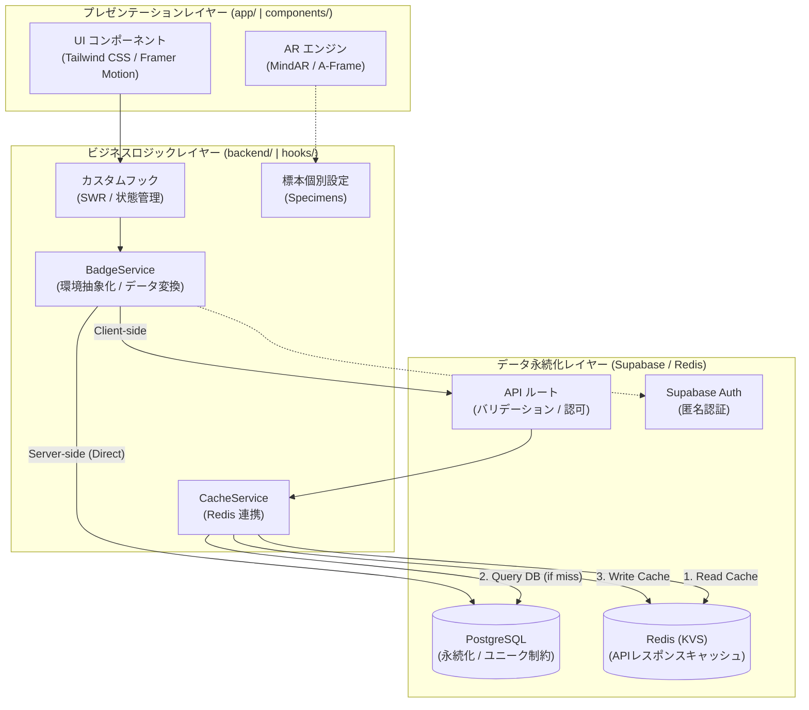

# アーキテクチャおよび技術設計

### 3層構造の設計と多層キャッシング

システムは、プレゼンテーションレイヤー、ビジネスロジックレイヤー、およびデータ永続化レイヤーの間で明確な関心の分離 (SoC) を実現し、高負荷に耐えうるキャッシング戦略を採用しています。

---

## 1. システムアーキテクチャ

---

## 2. 通信プロトコルの選定理由

- **REST (HTTP/2)**: 主要なリソース操作（標本データの取得、プロフィール更新等）に使用。
- **SSE / WebSockets**: Supabase Realtime を介したデータベース変更のリアルタイム Push に使用。

---

## 3. レンダリングおよびキャッシング戦略

### レンダリング手法

- **Server-Side Rendering (SSR)**: 初期表示速度の向上と SEO 対応のため、サーバーコンポーネントで初期データを取得。
- **Client-Side Rendering (CSR)**: AR エンジンの制御や、SWR による動的なデータ更新に使用。

### 多層キャッシング (Multi-layer Caching)

1.  **L1: クライアントキャッシュ (SWR)**: `stale-while-revalidate` 戦略により、画面遷移時に以前のデータを瞬時に表示。バックグラウンドで最新化を行うことで、読み込み待機時間を実質ゼロにしています。
2.  **L2: API レスポンスキャッシュ (Redis)**: 重い集計クエリ（管理者統計等）の結果を Redis に保存し、DB 負荷を軽減。
3.  **L3: エッジキャッシュ (CDN)**: 3Dモデルや画像等の静的アセットをエッジサーバーでキャッシュ。

---

## 4. 各レイヤーの責務

### 📂 プレゼンテーションレイヤー (View)

- **ハイブリッド描画**: ARカメラ画面（`/ar`）では動的な 3D レンダリングを行い、詳細ビューワー（`/viewer`）では高品質な 2D 画像を表示する、体験と実用性を両立した構成。
- **ネイティブ連携**: Web Share API を活用し、撮影画像の「写真」アプリへの保存を容易化。
- **インタラクティブUI**: 景品交換チケット（FinalLogModal）における 2段階確認フローの実装。

### 📂 ビジネスロジック層 (Logic)

- データの取得戦略（キャッシュ優先か DB 優先か）の決定。
- **BadgeService**: 環境に応じた最適な通信経路を選択。
- **CacheService**: Redis への GET/SET を抽象化。
- **標本詳細設定 (Specimens)**: `backend/lib/specimens/` 下に各 3D モデル固有のパラメータ（スケール、アニメーション、表示ロジック）を個別のファイルとして分離。

### 📂 データ・インフラ層 (Data)

- **API ルート**: セキュリティ、バリデーション、およびキャッシュ制御の強制。
- **PostgreSQL**: 永続的なデータの「真実のソース（Source of Truth）」。
- **Redis (Upstash)**: 一時的な高速アクセスのためのデータストア。

---

## 6. 運用コストとスケーラビリティ

本システムは、Vercel の無料枠（Hobby Plan）内でも安定して運用できるよう設計されています。

### Vercel 無料枠への適合性

1.  **静的アセットの最適化**: 3Dモデル (.glb) などの重いファイルは、Next.js のビルドプロセスを通じて CDN (Vercel Edge Network) で配信されます。100GB/月の帯域幅は、小〜中規模のプロトタイプには十分な容量です。
2.  **サーバーレス関数の負荷軽減**: 複雑な集計処理を Redis (Upstash) にキャッシュし、フロントエンドでは SWR を活用することで、API リクエスト数と実行時間を最小限に抑えています。
3.  **BaaS の活用**: データベースと認証には Supabase の無料枠を利用しており、Vercel 側のリソース（特にDB接続数）を圧迫しません。

### 将来の拡張性

- ユーザー数が増加した場合は、Vercel Pro Plan への移行や、Supabase のリソース増強のみで対応可能なステートレスな設計となっています。

---

## 8. デザイン哲学と世界観

本プロジェクトは「冒険者のフィールドジャーナル」という一貫したコンセプトの下、デザインと実装が行われています。

### 世界観の構成要素

- **アナログな質感**: UI コンポーネントには、古びた紙や革の質感を連想させる配色と影の演出を施しています。
- **気品あるタイポグラフィ**: 読みやすさと共に、探検記のような風格を感じさせるフォント選定とカーニングを採用しています。
- **情緒的なアニメーション**: Framer Motion を活用し、ページ遷移や標本の出現時に「発見の喜び」を感じさせる、滑らかで重みのある動きを実装しています。
- **没入感の追求**: AR 体験中も、単なるデジタルデータの表示ではなく、現実世界に「古の標本が顕現した」かのような演出（Specimens 設定による補正）を重視しています。

---

## 9. 技術的根拠のまとめ

| 技術                | 妥当性                                                                     |
| :------------------ | :------------------------------------------------------------------------- |
| **Next.js 16**      | SSR、APIルート、および外部パッケージトランスパイルの統合環境として。       |
| **Redis (Upstash)** | サーバーレス環境でのステートレスな高速キャッシングを実現するため。         |
| **Zod**             | TypeScript の型定義と実行時のバリデーションを一致させ、安全な通信を担保。  |
| **Supabase**        | PostgreSQL と認証機能を低コストで迅速に構築するため。                      |
| **SWR**             | クライアントサイドでの高度なデータ再検証とキャッシュ管理を容易にするため。 |
| **pnpm workspaces** | フロントエンドとバックエンドの物理的分離（モノレポ）を実現するため。       |
