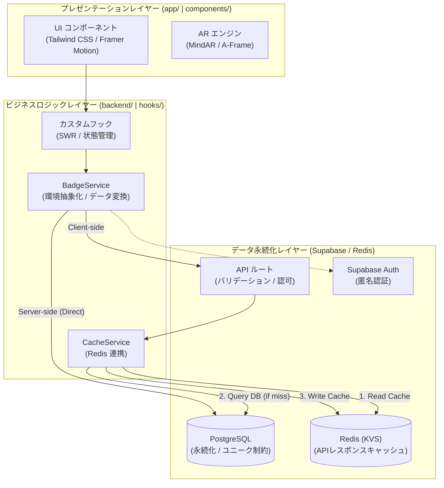

# アーキテクチャおよび技術設計

### 3層構造の設計と多層キャッシング

システムは、プレゼンテーションレイヤー、ビジネスロジックレイヤー、およびデータ永続化レイヤーの間で明確な関心の分離 (SoC) を実現し、高負荷に耐えうるキャッシング戦略を採用しています。

---

## 1. システムアーキテクチャ

---

## 2. 通信プロトコルの選定理由

- **REST (HTTP/2)**: 主要なリソース操作（標本データの取得、プロフィール更新等）に使用。
- **SSE / WebSockets**: Supabase Realtime を介したデータベース変更のリアルタイム Push に使用。

---

## 3. レンダリングおよびキャッシング戦略

### レンダリング手法

- **Server-Side Rendering (SSR)**: 初期表示速度の向上と SEO 対応のため、サーバーコンポーネントで初期データを取得。
- **Client-Side Rendering (CSR)**: AR エンジンの制御や、SWR による動的なデータ更新に使用。

### 多層キャッシング (Multi-layer Caching)

1. **L1: クライアントキャッシュ (SWR)**: `stale-while-revalidate` による UI の即時応答。
2. **L2: API レスポンスキャッシュ (Redis)**: 重い集計クエリ（管理者統計等）の結果を Redis に保存し、DB 負荷を軽減。
3. **L3: エッジキャッシュ (CDN)**: 3Dモデルや画像等の静的アセットをエッジサーバーでキャッシュ。

---

## 4. 各レイヤーの責務

### 📂 プレゼンテーションレイヤー (View)

- ユーザーインターフェースの提供と、センサー（カメラ）情報の入力。

### 📂 ビジネスロジック層 (Logic)

- データの取得戦略（キャッシュ優先か DB 優先か）の決定。
- **BadgeService**: 環境に応じた最適な通信経路を選択。
- **CacheService**: Redis への GET/SET を抽象化。

### 📂 データ・インフラ層 (Data)

- **API ルート**: セキュリティ、バリデーション、およびキャッシュ制御の強制。
- **PostgreSQL**: 永続的なデータの「真実のソース（Source of Truth）」。
- **Redis (Upstash)**: 一時的な高速アクセスのためのデータストア。

---

## 5. 技術的根拠のまとめ

| 技術                | 妥当性                                                                     |
| :------------------ | :------------------------------------------------------------------------- |
| **Next.js 16**      | SSR、APIルート、および外部パッケージトランスパイルの統合環境として。       |
| **Redis (Upstash)** | サーバーレス環境でのステートレスな高速キャッシングを実現するため。         |
| **Zod**             | TypeScript の型定義と実行時のバリデーションを一致させ、安全な通信を担保。  |
| **Supabase**        | PostgreSQL と認証機能を低コストで迅速に構築するため。                      |
| **SWR**             | クライアントサイドでの高度なデータ再検証とキャッシュ管理を容易にするため。 |
| **pnpm workspaces** | フロントエンドとバックエンドの物理的分離（モノレポ）を実現するため。       |
