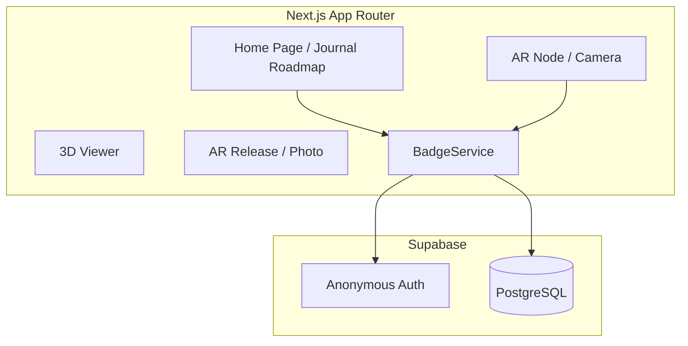

# 🏛️ Architecture & Technology Stack

## 1. アーキテクチャ概要 (Architecture Overview)

本プロジェクトは、保守性、拡張性、および AI による開発効率を最大化するため、**「Separation of Concerns（関心の分離）」**を徹底したレイヤー構造を採用しています。

- **UI レイヤー (`app/`, `components/`)**:
  Next.js ベースの「冒険者のフィールドジャーナル」としての視覚的世界観を担当。
- **API レイヤー (`app/api/`)**:
  フロントエンドとデータベースを仲介し、Zod 検証と構造化ログの記録を担当。
- **サービスレイヤー (`backend/services/`)**:
  Supabase SDK を介したデータ操作のビジネスロジックを集約。

## 2. 技術スタック (Technical Stack)

- **Frontend**: Next.js 16 (App Router), React 19, Framer Motion
- **Styling**: Tailwind CSS (v4) - アナログな手書き質感の実現
- **AR / 3D**: MindAR (Image Tracking), A-Frame, Google model-viewer
- **Backend**: Supabase (PostgreSQL / Auth)
- **Quality**: Lefthook, ESLint, Prettier, Zod

## 3. 処理の流れ (Data Flow)

### 標本獲得のメインサイクル

1.  **Entry**: ユーザーがホームにアクセス。匿名認証により `userId` が発行される。
2.  **Scan**: ARカメラを起動。`useAR` フックがターゲット（絵画）をスキャン。
3.  **Analysis**: `targetFound` イベントが発生。画面上に「標本登録証」が生成される。
4.  **Registration**: `BadgeService.acquireBadge()` を通じて Supabase DB へ記録。
5.  **Roadmap**: ホーム画面に戻ると、獲得した標本がスタンプされ、**黄金色のエネルギーパス**がゴールへ向かって伸びる。
6.  **Goal**: 全ての標本が揃うと、最終目的地で「FINAL LOG（最終日誌）」が刻印される。
