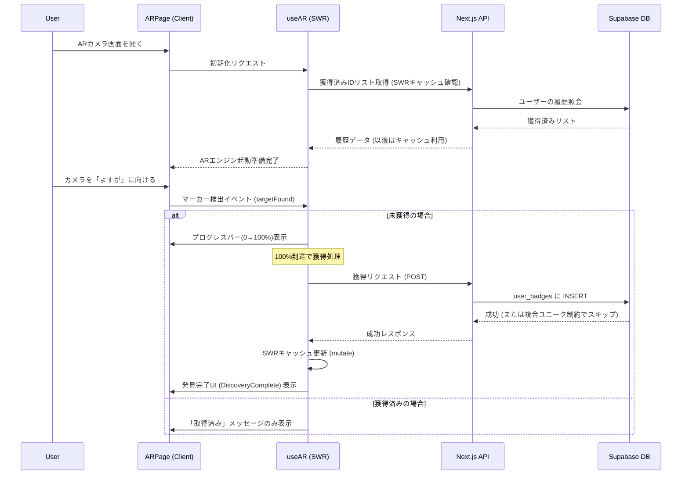

# 🎨 絵画コレクション設定仕様書

本ドキュメントでは、AR空間および詳細ビューワーにおける絵画作品の表示設定について解説します。

---

## 1. コンセプト：体験と実用のハイブリッド

本アプリケーションは、ARによる「驚き」と、図録による「詳細な鑑賞」を両立させています。

### 🔍 ARスキャン画面 (`/ar`)

- **目的**: 現実空間への作品の顕現。
- **挙動**: 各作品に紐付いた **3Dモデル (.glb)** が出現します。生物やアーティファクトが立体的に動き、発見の喜びを演出します。

### 🖼 詳細ビューワー (`/viewer`)

- **目的**: 作品の細部までの鑑賞。
- **挙動**: 3Dモデルではなく、**実際の高解像度絵画画像 (2D)** を豪華な額縁演出で表示します。これにより、モバイル環境でもストレスなく、作品本来の魅力を伝えることが可能です。

---

## 2. 設定の管理構造

標本の設定は、`backend/lib/specimens/` ディレクトリ内で標本ごとに独立したファイルとして管理されています。

- **`types.ts`**: 設定項目のインターフェース定義
- **`index.ts`**: 全標本設定の集約と提供
- **`[標本名].ts`**: 個別の 3D パラメータ定義

---

## 2. 設定パラメータの定義

`SpecimenSettings` インターフェースで定義されている主要な項目は以下の通りです。

| パラメータ              | 役割               | 説明                                                      |
| :---------------------- | :----------------- | :-------------------------------------------------------- |
| `scale`                 | 標準スケール       | ARマーカー上で表示される際の基準サイズ                    |
| `position`              | 位置補正           | モデルの重心補正用（例: `"0 0.5 0"`）                     |
| `rotation`              | 回転補正           | モデルの初期向きの補正用（例: `"0 90 0"`）                |
| `outerAnimation`        | 外側アニメーション | モデル全体に対する動き（主に Y軸回転）                    |
| `innerAnimation`        | 内側アニメーション | 浮遊感や伸縮など、モデル固有の微細な動き                  |
| `animationMixer`        | 内部アニメ制御     | GLB内の特定クリップ指定や速度調整（例: `"timeScale: 2"`） |
| `minScale` / `maxScale` | オートスケール範囲 | カメラとの距離に応じた自動リサイズの限界値                |

---

## 3. シーン別の出し分けロジック

アプリケーションの画面に応じて、適用される設定が自動的に切り替わります。

### 🔍 ARスキャン画面 (`/ar`)

- **目的**: 観察、解析、および記念撮影。
- **挙動**: 標準の `scale`, `position`, `rotation` を使用。マーカーの真上で一定のサイズに収まるように調整されます。また、画面上のキャプチャボタンから現実世界と標本を一緒に撮影できます。撮影時はスマホの共有メニュー（シェアシート）が立ち上がり、ユーザーが直接「画像を保存」を選択してカメラロールへ格納したり、SNSで共有したりすることが可能です。

---

## 4. 標本別設定のポイント

現在の主要な作品設定の設計方針です。全ての作品は、ARマーカー（絵画）から飛び出す「圧倒的な存在感」を演出するため、**巨大なスケール**で設定されています。

- **お母さんの初水族館 (旧: クジラ)**: スケール 1.2。絵画の表面に密着させつつ、ゆっくりと全体が回転します。
- **sample (旧: 蝶)**: スケール 1.2。有機的なゆらぎ（回転の揺れ）と、画面の手前へ迫る動きを設定。
- **ちょっと不思議な海の冒険 (旧: ヤドカリ)**: スケール 1.2。正面向きで静止しつつ、微細な浮遊感を持たせています。
- **海底の奥 (旧: 剣)**: スケール 1.0。静かに回転しつつ、上下にゆっくりと浮遊します。
- **よすが (旧: 波)**: スケール 0.8。初期状態で斜めを向き、激しいうねりを表現。
- **遊々海月 (旧: クラゲ)**: スケール 1.0。大きく回転しながら、上下・前後・左右に広範囲に漂う幻想的な動き。

---

## 5. AR体験の内部フロー (Sequence Diagram)

AR画面を開いてから作品を発見し、データベースに保存されるまでの流れを以下に示します。

---

## 6. ライティング設計方針

AR空間全体のトーンを落ち着かせ、モデルの白飛びを防ぐため、以下の設定を基本としています。

- **全体環境光 (Ambient)**: `0.2`（白飛びを抑えた低輝度設定）
- **全体平行光 (Directional)**: `0.4`（質感と影を出すための補助光）
- **個別ライト**: 視認性が低い特定のモデル（ヤドカリ等）には、`frontend/app/ar/page.tsx` 内で条件分岐により点光源 (`point`) やスポットライト (`spot`) を個別に追加しています。

## 7. 3Dモデルの最適化とパフォーマンス

モバイル AR における快適な体験と帯域幅の節約のため、以下の最適化を推奨します。

- **Draco 圧縮 / Meshopt**: ジオメトリを圧縮し、ファイルサイズを削減。
- **テクスチャサイズ**: モバイルデバイス向けに 1024x1024 以下に制限。
- **ポリゴン数**: 1モデルあたり 50,000 ポリゴン以内を目安とする。
- **目標ファイルサイズ**: 初期ロード時間を短縮するため、1モデル 5MB 程度を目標とする（現状、クジラやクラゲなどは 16MB 程度あるため、将来的な最適化対象）。

## 8. 新しい標本の追加手順

1. `backend/lib/specimens/` に新しい `.ts` ファイルを作成。
2. `types.ts` の `SpecimenSettings` に準拠したオブジェクトを定義。
3. `index.ts` でインポートし、`SPECIMEN_SETTINGS` マップに登録。
